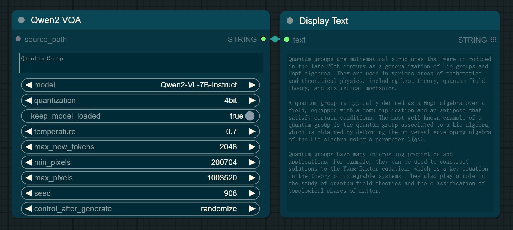
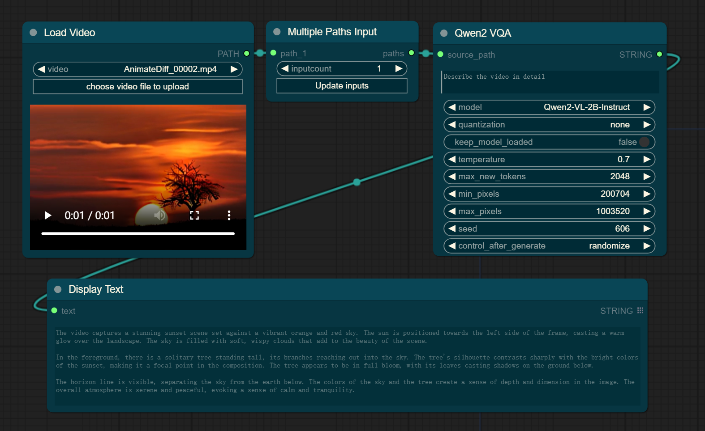
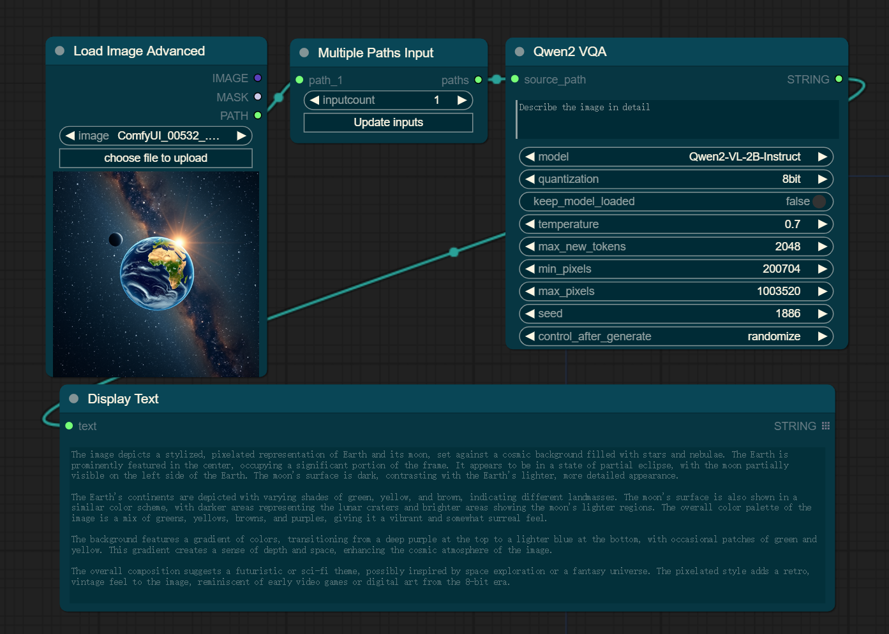
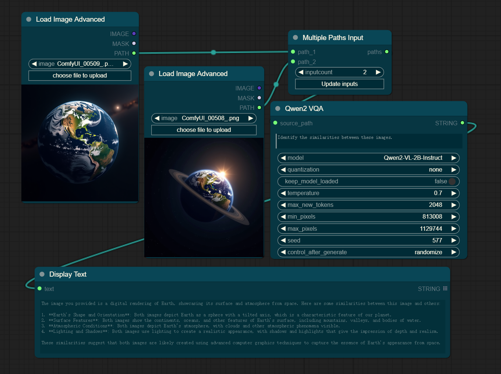

# Comfyui_Qwen3-VL-Instruct

This is an implementation of [Qwen3-VL-Instruct](https://github.com/QwenLM/Qwen3-VL) by [ComfyUI](https://github.com/comfyanonymous/ComfyUI), which includes, but is not limited to, support for text-based queries, video queries, single-image queries, and multi-image queries to generate captions or responses.

---

## Basic Workflow

- **Text-based Query**: Users can submit textual queries to request information or generate descriptions. For instance, a user might input a description like "What is the meaning of life?"



- **Video Query**: When a user uploads a video, the system can analyze the content and generate a detailed caption for each frame or a summary of the entire video. For example, "Generate a caption for the given video."



- **Single-Image Query**: This workflow supports generating a caption for an individual image. A user could upload a photo and ask, "What does this image show?" resulting in a caption such as "A majestic lion pride relaxing on the savannah."



- **Multi-Image Query**: For multiple images, the system can provide a collective description or a narrative that ties the images together. For example, "Create a story from the following series of images: one of a couple at a beach, another at a wedding ceremony, and the last one at a baby's christening."



> [!IMPORTANT]
> Important Notes for Using the Workflow
> - Please ensure that you have the "Display Text node" available in your ComfyUI setup. If you encounter any issues with this node being missing, you can find it in the [ComfyUI_MiniCPM-V-4_5 repository](https://github.com/IuvenisSapiens/ComfyUI_MiniCPM-V-4_5). Installing this additional addon will make the "Display Text node" available for use.

## Installation

- Install from [ComfyUI Manager](https://github.com/ltdrdata/ComfyUI-Manager) (search for `Qwen3`)

- Download or git clone this repository into the `ComfyUI\custom_nodes\` directory and run:

```python
pip install -r requirements.txt
```

## Download Models

All the models will be downloaded automatically when running the workflow if they are not found in the `ComfyUI\models\prompt_generator\` directory.

## External Models

You can easily add other Qwen3 Models hosted on huggingface by simply adding them to the ``external_models.json`` file with the following syntax:
````
Add models customized for your needs in the following format
"model-name-in-dropdown": {
  "repo_id": "user/repository-name",
  "ignore_patterns": ["folders/files-to-ignore", "other-folder/*"], 
}
```` 
- The ``model-name-in-dropdown`` value will be what's shown as the selection titel of the model inside the node's ``model`` value.
- The ``repo_id`` is the combination of the username/modelname from the huggingface repository
- The ``ignore_patterns`` value gives you the option to ignore specific files or folders like the gguf folder in some repos that are neither required nor usable by this node. This saves you time & space downloading unnecessary files. <br>
You can, for example, use ``"ignore_patterns": ["gguf/**"]`` to ignore the gguf and all subfolders+subfiles in the repository.